Photoshop Online Course UY Lab
---------------------------------
This repository includes all the images files that I created during an online course from UY Lab.
I have learned the basics of Photoshop I think. And Now I can start my graphics design journey if I feel like it.
--------------------------------------------
Note: You are free to download my full repository for personal purpose only.
--------------------------------------------
Visit the following link, if you can not see the photos
--------------------------------------------
https://shuvongkor-barman.github.io/photoshop_online_course_UY_Lab/
-----------------------------------------------
Photos that I created or edited using Photoshop
----------------------------------------------
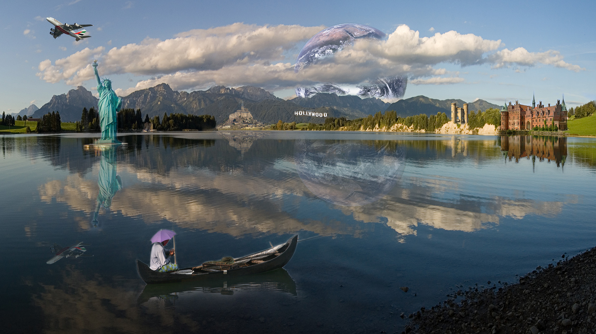
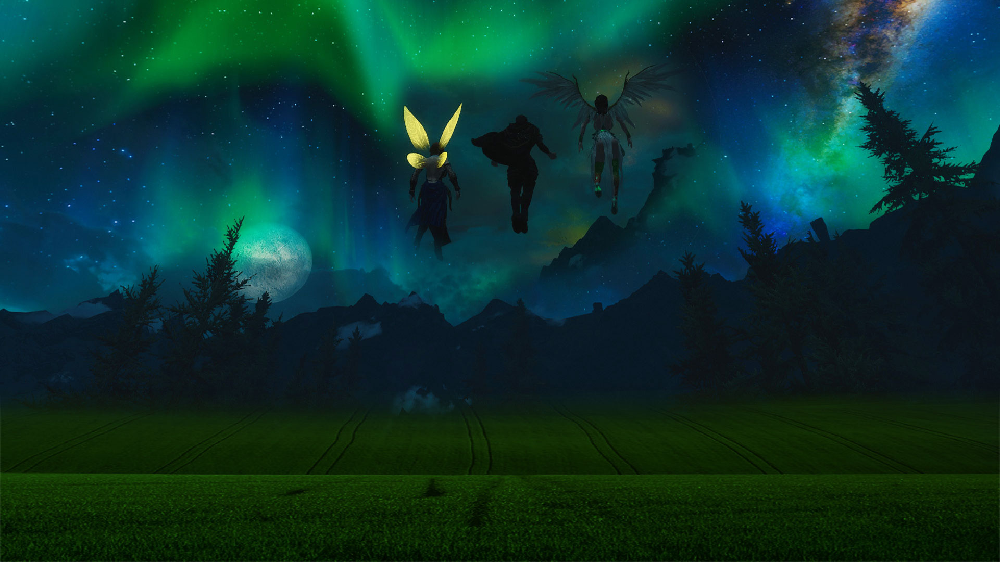
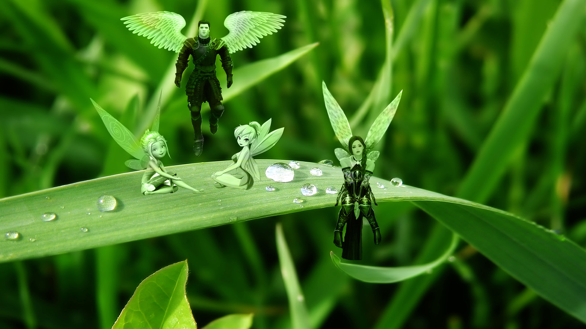
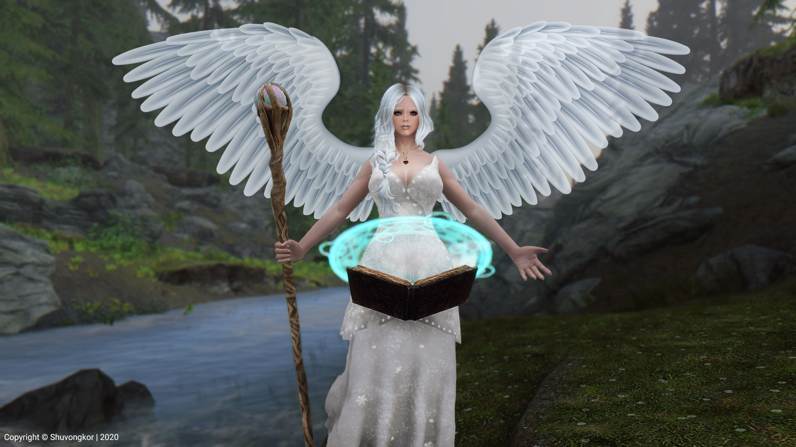
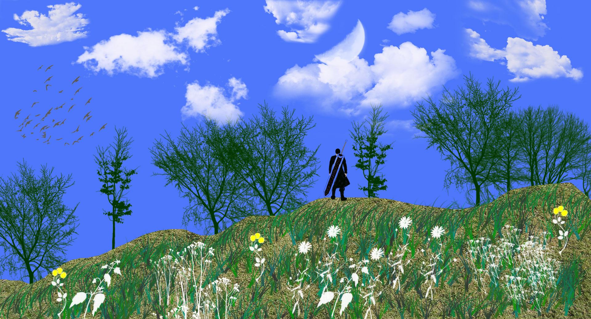
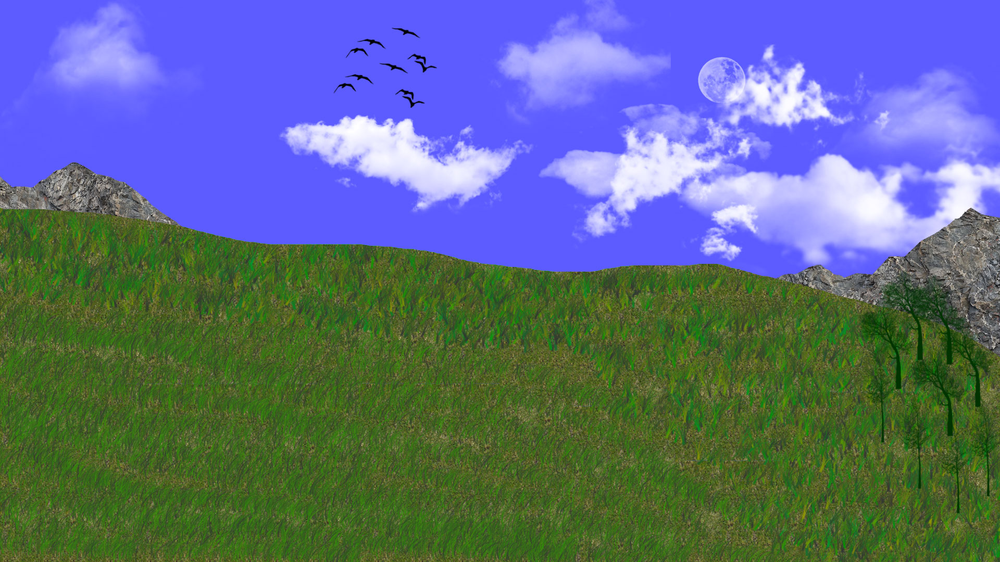
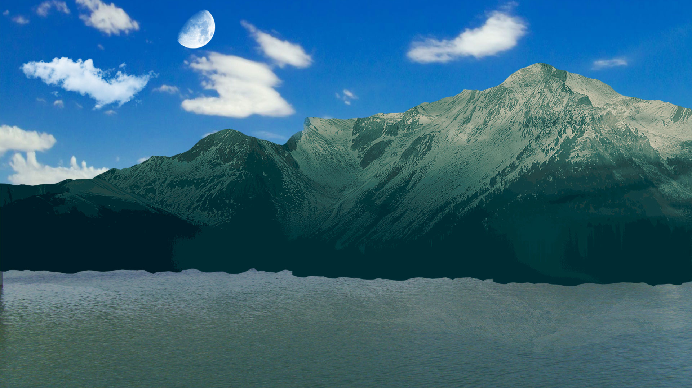
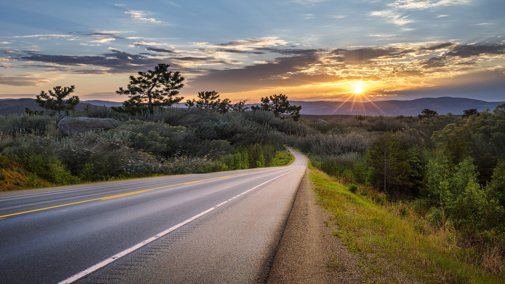
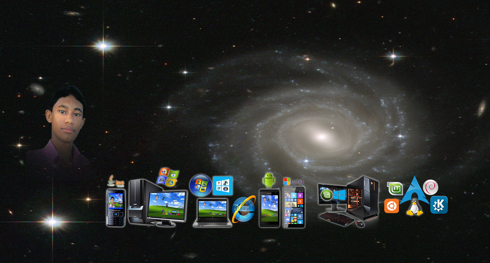
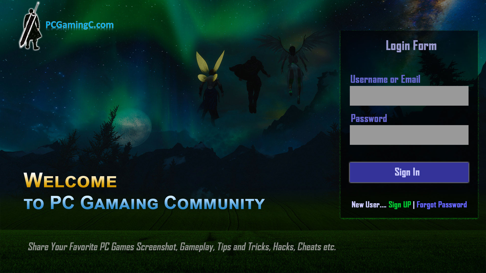
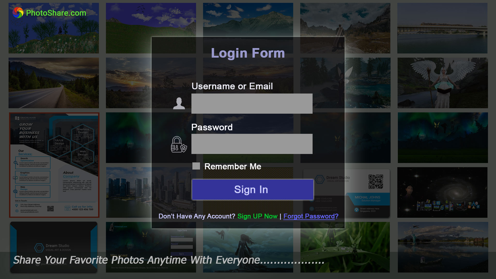

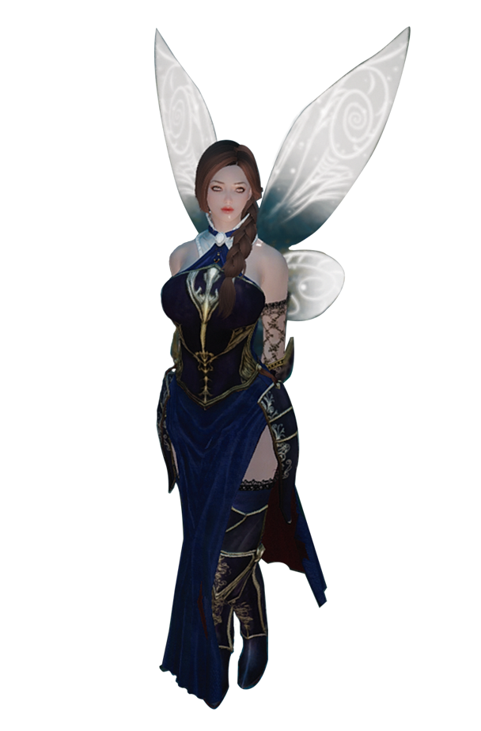
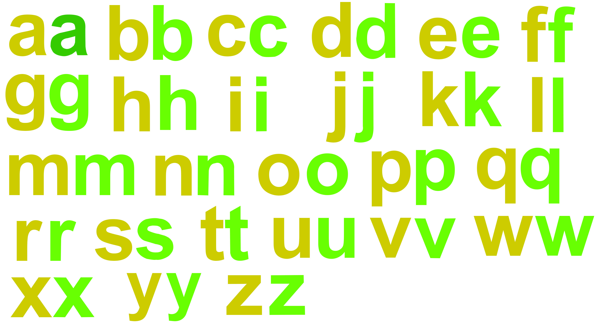
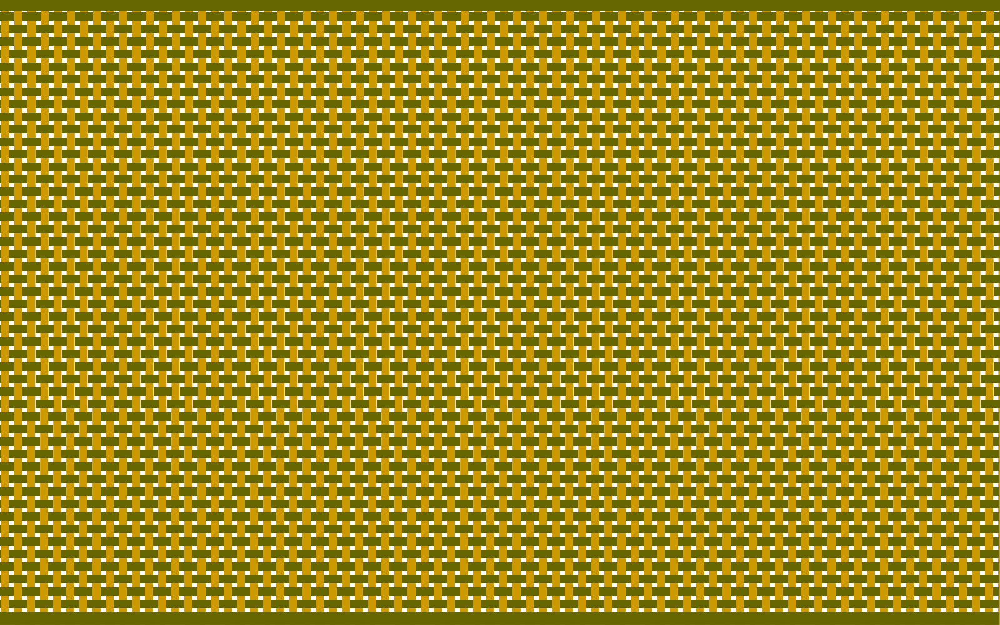
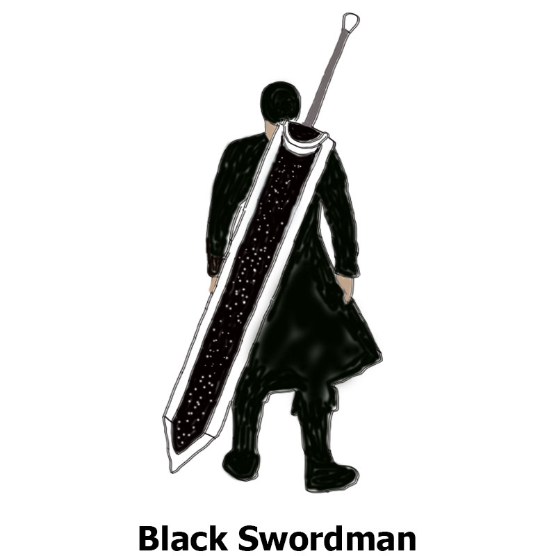
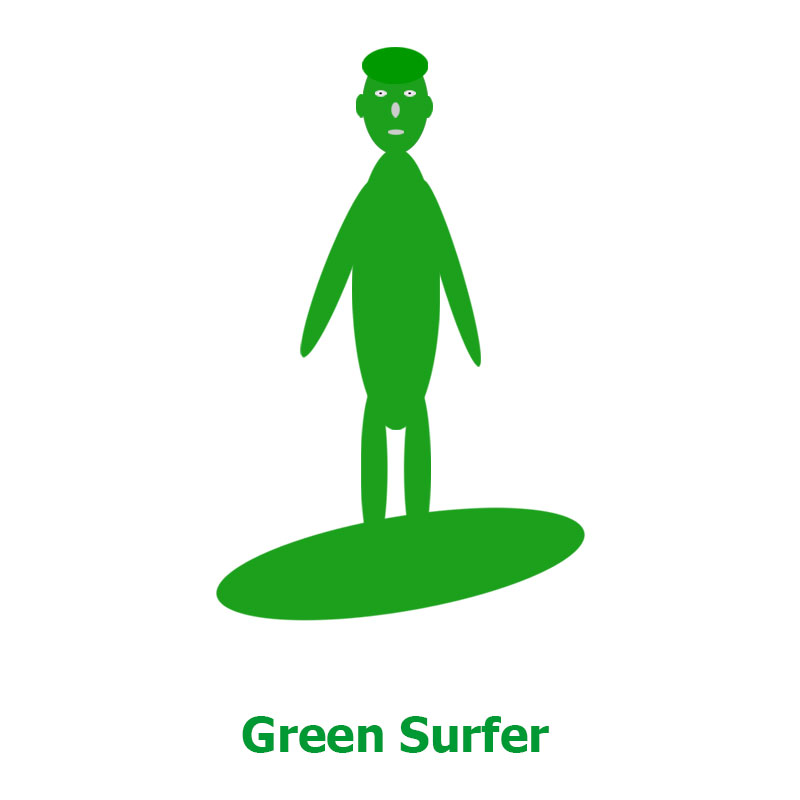
